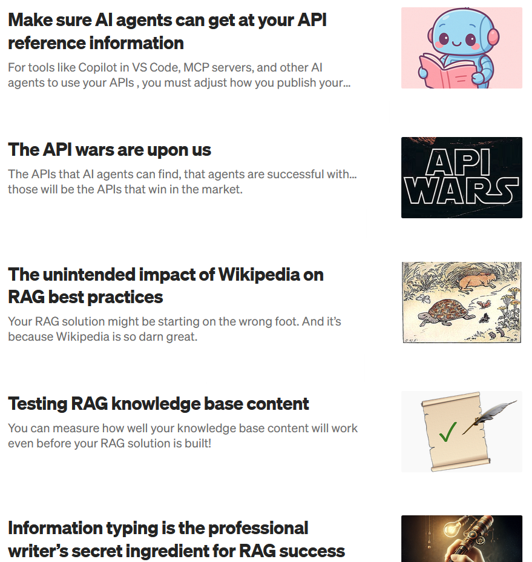

# Sarah Packowski

A+ second-year student, Bachelor of Engineering (Automation and Robotics Engineering) (Co-op) program. 10+ years experience in software development, AI, and prototyping. 

Seeking a 2027 summer internship position to apply engineering fundamentals, contribute to real-world projects, and learn from experienced automation and robotics teams.

### Resume
[Full resume](https://github.com/spackows/Resume/blob/main/resume_Sarah-Packowski_ROSCon-03_2026-09-20.pdf)

### Contact
[pack0024@algonquinlive.com](mailto:pack0024@algonquinlive.com)

### Papers
- [Optimizing and Evaluating Enterprise Retrieval-Augmented Generation (RAG): A Content Design Perspective](https://github.com/spackows/ICAAI-2024_RAG-CD)
- [Using IBM Watson Services to Process Video to Streamline Business Processes and Improve Customer Experience](https://github.com/spackows/CASCON-2021_Processing_video)
- [A lightweight and flexible process for designing intuitive error handling and effective error messages](https://github.com/spackows/CASCON-2009_Error-messages)

### Workshops
- [Natural language interfaces powered by large language models](https://github.com/spackows/CASCON-2024_NL-interfaces)
- [Using the IBM Watson Natural Language Processing library with the online collaboration tool MURAL](https://github.com/spackows/WEAVESPHERE-2022-MURAL-IBM-Watson)
- [Building game-playing chatbots using IBM Watson Assistant](https://github.com/spackows/CASCON-2021_Game-playing-chatbots)
- [Building a model evaluation framework in Python](https://github.com/spackows/CASCON-2020-Workshop_Model-evaluation-framework)
- [Natural language processing with IBM Watson](https://github.com/spackows/CASCON-2019_NLP-workshops)
- [Building image-processing AI models with IBM Watson Studio](https://github.com/spackows/CASCON-2018_Analyzing_images)

### Presentations	
-	[Testing question-answering RAG knowledge base content](https://github.com/spackows/ConVEx-2025)
- [Growing in Content: Writers are needed more than ever](https://github.com/spackows/Growing-in-Content_2025)
- [AI ethics: From top-down to bottom-up](https://github.com/spackows/CASCON-2021_AI_ethics)

### School team projects
- [Mousetrap autonomous car](https://github.com/spackows/Mousetrap-Car_ENG8001)
- [Warehouse robot arm](https://github.com/spackows/Robot-arm_ROB8112)

### Blog
[sarah-packowski.medium.com](https://sarah-packowski.medium.com)

&nbsp;

